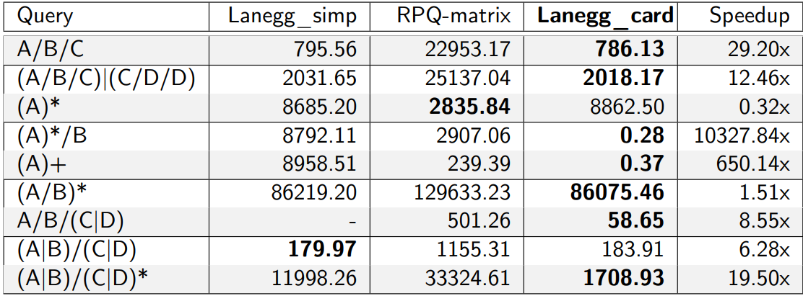
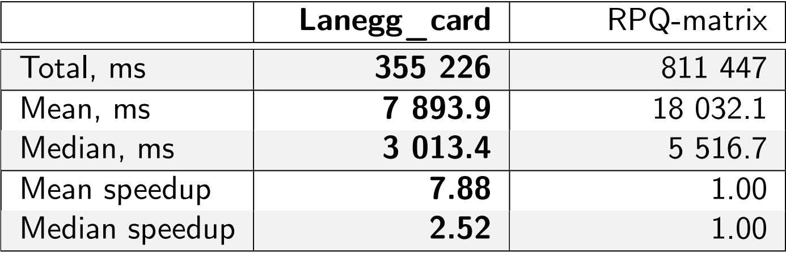
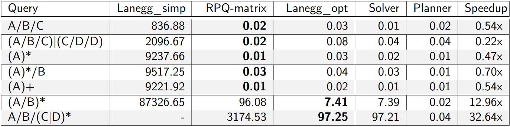
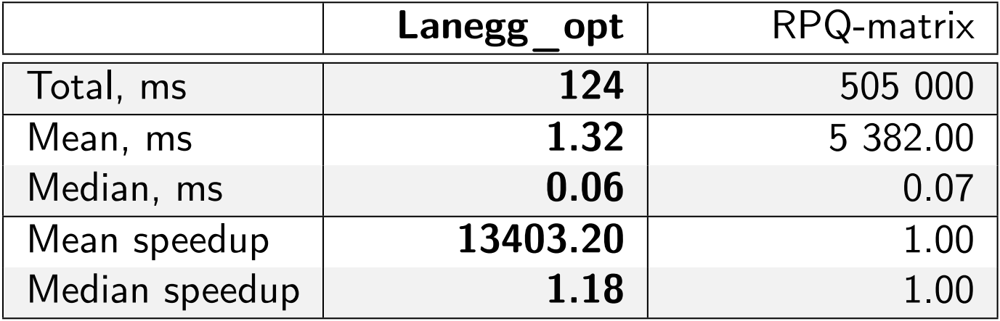

# Results of LaneggRPQ benchmarks
This repository contains results of regular path querry solvers benchmarks.

## Solvers
In this work, we consider the following RPQ solvers.

1. **Lanegg_simp** --- [LaneggRPQ](https://github.com/SparseLinearAlgebra/la-n-egg-rpq) solver without any plan optimizations.
2. **Lanegg_card** --- [LaneggRPQ](https://github.com/SparseLinearAlgebra/la-n-egg-rpq) solver with optimized plan via cost function based on cardinality of matrices.
3. **RPQ-matrix** --- [RPQMatrix](https://github.com/adriangbrandon/rpq-matrix) solver presented in [following work](https://link.springer.com/article/10.1007/s00778-024-00885-6).

## Datasets
We choose following datasets for RPQ solvers benchmarking.
1. **Wikidata** --- This dataset was present in [MillenniumDB path query challenge](https://github.com/MillenniumDB/path-query-challenge). It contains:
    - 610 millions of edges
    - 91 millions of vertices
    - 1400 unique labels
    - 45 `any-to-any` queries
    - 94 `con-to-any` queries

2. **RPQBecnh** --- generated synthetical [database](https://www.researchgate.net/publication/386377372_RPQBench_A_Benchmark_for_Regular_Path_Queries_on_Graph_Data). It contains:
    - 150 millions of edges
    - 57 millions of vertices
    - 9 unique labels
    - 9 `any-to-any` queries
    - 7 `con-to-any` queries

## Machine
The benchmarks were conducted on a machine with the following specifications.
- CPU: AMD Ryzen 9 7900X, 12 physical, 24 logical cores;
- RAM: 128 Gb, 3600 MHz, DDR5;
- OS: Linux Ubuntu 22.04;

## Results
*The standard deviation of measurements for all queries does not exceed 5 % of the mean.*
### any-to-any queries
**1. RPQBench**

Table below demonstrates the result obtained from RPQBench dataset on each query. All values are presented in milliseconds.

- `Lanegg_simp` failed with OOM on the 7th query presented in table

**2. Wikidata**

The table below shows summary statistics for all wikidata queries. Detailed results for each query are available in the wikidata folder.

### con-to-any queries
**1. RPQBench**

Table below demonstrates the result obtained from RPQBench dataset on each query. All values are presented in milliseconds.

- Column `Solver` and `Planner` shows how much time was spent on plan execution and plan optimization in `Lanegg_card` case.

- `Lanegg_simp` failed with OOM on the last query presented in table

**2. Wikidata**

The table below shows summary statistics for all wikidata queries. Detailed results for each query are available in the wikidata folder.

